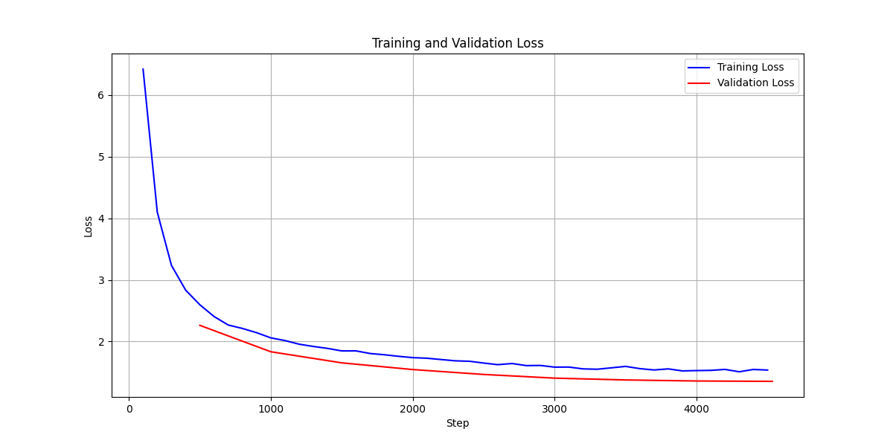

# PEFT Customer Support

## Summary of Results

- **Original Foundation Model Perplexity:** 1,901.69
- **PEFT Fine-Tuned Model Perplexity:** 3.85
- **OriginalFoundation Model SacreBLEU Score:** 1.50e-12
- **PEFT Fine-Tuned Model SacreBLEU Score:** 3.98

---

## Perplexity Evaluation
Perplexity is defined as:

$$
\text{Perplexity} (\text{PPL}) = e^{\text{Loss}}
$$

Where:
- $\text{Loss}$ is typically the cross-entropy loss computed during evaluation.

> [!NOTE]
> **Lower Perplexity:** The model predicts the sample more accurately.
> 
> **Higher Perplexity:** The model is less certain about its predictions.

### Perplexity Results

#### Original Foundation Model

- **Evaluation Loss:** Calculated using the pre-trained model without any fine-tuning.
- **Perplexity Calculation:**

$$
\text{Perplexity}_{\text{foundation}} = e^{\text{eval\_loss}_{\text{foundation}}} = e^{\text{loss}_{\text{foundation}}} \approx 1,901.69
$$

#### PEFT Fine-Tuned Model

- **Evaluation Loss:** Calculated after fine-tuning the model using PEFT (Parameter-Efficient Fine-Tuning).
- **Perplexity Calculation:**

$$
\text{Perplexity}_{\text{PEFT}} = e^{\text{eval\_loss}_{\text{PEFT}}} = e^{\text{loss}_{\text{PEFT}}} \approx 3.85
$$

**Result:** A perplexity of ~3.85 signifies a substantial improvement, indicating that the PEFT fine-tuned model is much more confident and accurate in its predictions compared to the original foundation model.

---

## BLEU Score Evaluation
> [!NOTE]
> **BLEU (Bilingual Evaluation Understudy)** is a precision-based metric that evaluates the quality of machine-generated text by comparing it to one or more reference texts.

The BLEU score defined as:

$$
\text{BLEU} = BP \cdot \exp \left( \sum_{n=1}^{N} w_n \cdot \log p_n \right)
$$

Where:
- \( BP \) is the **brevity penalty**.
- \( p_n \) is the **precision** for n-grams.
- \( w_n \) is the **weight** assigned to each n-gram precision.
- \( N \) is the maximum n-gram order (commonly 4).

#### Brevity Penalty (BP)

The brevity penalty penalizes short translations that are shorter than the reference:

$$
BP =
\begin{cases} 
1 & \text{if } c > r \\
\exp\left(1 - \frac{r}{c}\right) & \text{if } c \leq r 
\end{cases}
$$

Where:
- \( c \) is the length of the candidate (generated) sentence.
- \( r \) is the effective reference corpus length.

#### Precision for n-grams \( p_n \)

$$
p_n = \frac{\text{Number of matching n-grams}}{\text{Total number of candidate n-grams}}
$$

> [!NOTE]
> **Higher BLEU Score:** Indicates closer similarity between the generated text and the reference text.
> 
> **Lower BLEU Score:** Suggests greater divergence from the reference.

### BLEU Score Results

#### Pre-trained Foundation Model

- **SacreBLEU Score Calculation:**

$$
\text{SacreBLEU}_{\text{foundation}} \approx 1.50 \times 10^{-12}
$$


#### PEFT Fine-Tuned Model

- **SacreBLEU Score Calculation:**

$$
\text{SacreBLEU}_{\text{PEFT}} \approx 3.98
$$

A BLEU score of ~3.98, while still low in absolute terms, shows improvement over the original foundation model's score. It addresses that the PEFT model is generated responses and have a meaningful alignment with the reference responses, enhanced performance.


> [!NOTE]  
> **BLEU Score Interpretation:**  
> While BLEU scores provide a quantitative measure of similarity, they have limitations, especially in capturing semantic nuances. It's advisable to complement BLEU with other evaluation metrics like ROUGE, METEOR, or human evaluations for a more comprehensive assessment.

> [!TIP]  
> **SacreBLEU Installation:**  
> Ensure that SacreBLEU is installed in your environment. You can install it using:
> 
> ```bash
> pip install sacrebleu
> ```

---

## Training Progress

The training process demonstrated a consistent decrease in both training and validation loss over time, indicating effective learning and generalization.

| Step | Training Loss | Validation Loss |
|------|---------------|------------------|
| 500  | 2.6037        | 2.2595           |
| 1000 | 2.0559        | 1.8228           |
| 1500 | 1.8576        | 1.6477           |
| 2000 | 1.7283        | 1.5392           |
| 2500 | 1.6659        | 1.4607           |
| 3000 | 1.6007        | 1.3988           |
| 3500 | 1.5753        | 1.3676           |
| 4000 | 1.5330        | 1.3529           |
| 4500 | 1.5269        | 1.3470           |

**Final Training Output:**

$$
\text{Training Loss} = 1.9689, \quad \text{Epoch} \approx 3.00
$$


## Conclusion

This result representation shows the relationship between the evaluation loss and perplexity, as well as the BLEU scores, Overall PEFT represent more effective improvement.

$$
\begin{align*}
\text{Perplexity}_{\text{foundation}} &= e^{\text{eval\_loss}_{\text{foundation}}} \approx 1,901.69 \\
\text{Perplexity}_{\text{PEFT}} &= e^{\text{eval\_loss}_{\text{PEFT}}} \approx 3.85 \\
\\
\text{SacreBLEU}_{\text{foundation}} &\approx 1.50 \times 10^{-12} \\
\text{SacreBLEU}_{\text{PEFT}} &\approx 3.98 \\
\end{align*}
$$


|                 | Orifinal Foundation Model              | PEFT Fine-Tuned Model       |
|-----------------------|-------------------------------|------------------------------|
| **Training**          | No fine-tuning                | Fine-tuned using PEFT         |
| **Perplexity**        | ~1,901.69 (High)              | ~3.85 (Low)                   |
| **SacreBLEU Score**   | ~1.50e-12 (Negligible)        | ~3.98 (Improved)              |
| **Performance**       | Lower confidence in predictions | Higher confidence and accuracy in predictions |

<div style="text-align:center">
    
</div>
---
